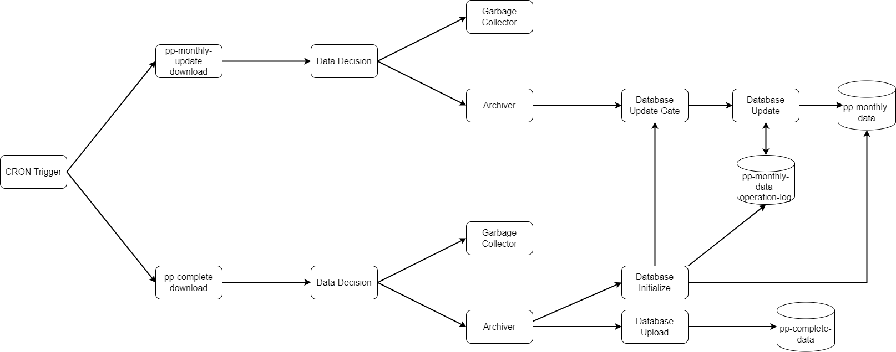

# Land-Registry-Data-Ingestion
Land Registry Data Ingestion System

## Technology List

- Python
- Docker
- Linux
- Kafka
- Postgres (database)
- Jypyter
- Pandas
- Threading, multithread processing, inter-thread signals
- sqlalchemy
- CRON (Python `croniter`)
- Python logging framework
- systemd (older versions)
- sqlite3 (older versions)


# What?

This is a data ingestion system which downloads data from the Land Registry and ingests this data into a database. The Land Registry dataset contains price paid data for properties sold in the UK.

A system diagram is shown below. Most, but not all, of these components have been implemented. The `pp-monthly` database update chain is currently not implemented. This cannot be completed until the UK Land Registry is able to send a complete set of monthly update history, which they are not yet able to do.




# Why?

The easiest way to obtain the Land Registry data would be to simply download the complete file from the website. (`pp-complete.txt`) It would be relatively trivial to build a single process which simply downloads the data on a per-day or per-month basis. However, how would we implement such a data source with a database?

The intention is to store this data in a PostgreSQL database such that it can be queried. The alternative would be to build an analysis code which starts by loading the entire file from disk into a Pandas dataframe. The latter option would not only be slow, but would also consume significant quantities of memory.

Storing the data in a queryable database is useful as often an analysis will focus on one category of data. For example, one analysis may focus on a subset of data, such as flat prices or prices of properties sold during a particular period of time. Therefore this system is designed to ingest data to a SQL database such that a subset of data can be queried.


# How?

The Land Registry publish the complete dataset `pp-complete.txt` each month. A monthly update dataset is also published. The monthly update dataset contains a list of rows to insert, modify or delete. By applying these operations to an existing database, the complete data can be maintained across time.

#### Why not just upload the complete dataset each month?

This would be possible, but not particularly convenient. In particular, uploading the entire dataset takes about an hour, and the number of rows grows each month. While this method would work, it would create a period of downtime where the data in the database is not accessible because it has been deleted pending the upload of a new dataset.

For a personal project, this is not really a concern. However, one purpose of this project is to show an example of a production-grade system which could be used by analysts 24/7 without downtime.

There is another reason not to use the complete dataset published each month which is of more importance. Data from the Land Registry is published monthly. However, this does not guarantee that once any months data has been published, that no new data will be added for that month at a later date.

In most cases, there is some unknown and variable delay between a property being sold, and the price paid data being updated in the dataset available here. In addition, changes can be made at any point in the future to correct existing issues in the data.

From a practical standpoint of performing data analysis, there is no certain way to know as to what date data can be considered "reliable" or "mostly complete". Put another way, if the complete data file were to be downloaded on 2024-07-01, there would likely be transactions for all (working) days before this date. However, if the data file is downloaded the next month, it is usually the case that a significant number of new rows will appear for transaction dates prior to 2024-07-01.

It is only by recording information about the date when data becomes available that an analysis can be performed to measure the expected distribution of delay times between a reported transaction date, and the data becoming available in the file downloaded from the Land Registry. The Land Registry data only contains transaction dates. It does not declare when any particular row of data was added. This is the primary reason why I built this system.

**The following figures may help to explain this concept in more detail:**

The first figure shows the count of the number of properties by *delay time*. Delay time is defined as the number of days between the date on which the dataset was published and the transaction date.


At the time of writing, the first captured publish date was 2023-09-10. This date does not co-incide with a scheduled release date for the data. The next captured publish date was 2023-09-29, which is a scheduled monthly release date. When the data was downloaded on 29th September, new rows appeared for the month of September. These new rows were not present in the previously downloaded file, downloaded on 10th September. Therefore, from 2024-09-29 onwards, it is possible to measure the delay time between a transaction occuring (transaction date value of a row) and rows appearing in the published dataset. (This is not known exactly but approximated. The monthly release schedule is known, and by downloading the data each day it is possible to record a "created datetime" for each row.)

Note that data shown in the figure beyond approximately 250 days is not valid, as this corresponds to a transaction date of before September 2023.

The figure suggests that a significant number of transactions are delayed by more than 9 months.

The housing market data contains significant seasonal effects, as more properties are sold during the spring and less are sold in the first few months of the year. It is difficult to account for seasonal effects.

The data shown in the below figure is corrected for daily transaction volume by producing a weight which is inversely proportional to the number of transactions which occur each day. This corrects for bias in the above figure caused by variations in the number of sales across time. As an additional bonus, since there are a large number of rows with transaction dates before September 2023, these rows have very small associated weights. The result is that data older than September 2023 is diminished in the normalized figure.


# System Archetecture

The system consists of a data ingestion pipeline. This is a number of processes which communicate together via Kafka, which is a message broker. Each process runs inside a Docker container. This is mostly for deployment convenience.

Each process either operates on a file, manipulates one or more database tables, or performs both types of operation. Files are stored on a Minio instance, which is a self-hosted alternative to AWS S3. The database tables are stored in a Postgres database.

The list of processes, in their order of operation are:

- CRON Trigger: (`land_registry_cron_trigger`) This process emits a message to Kafka triggered by a CRON schedule. Rather than using the Linux CRON system, a CRON Python library is used to generate a target datetime for when the process should next dispatch a message. The process uses `sleep` to wait until the target time.
- File Download Service: (`land_registry_pp_complete_download_service`, `land_registry_pp_monthly_update_download_service`) This pair of processes download the complete dataset `pp-complete.txt` and current month incremental update dataset `pp-monthly-update.txt`. These processes also save the data in a temporary storage space (an S3 bucket), calculate the SHA-256 sum of the data contained inside the files, and stores this information in a database table. The SHA-256 sum is used to compare pairs of files across days. If the shasum of a downloaded file differs from the previous days file, then this implies the file contains new data which should be ingested to the database table.
- Data Decision Service: (`land_registry_pp_complete_data_decision_service`, `land_registry_pp_monthly_update_data_decision_service`) This pair of process contains logic decide what to do with the most recently downloaded files. It uses the calculated shasum hash values to decide if a file has been previously seen before, or contains new data. Files which have previously been seen before are discarded. File containing new data are processed further and the new data is uploaded to the database.
- Garbage Collection (GC) Service: (`land_registry_pp_complete_gc_service`, `land_registry_pp_monthly_update_gc_service`) These processes perform garbage collection. They delete files which have been marked as containing no new data.
- Archive Service: (`land_registry_pp_complete_archive_service`, `land_registry_pp_monthly_update_archive_service`) These processes perform file archiving. This simply means moving the file from a temporary storage location to the archive storage location. These are just two differently named S3 buckets.
- Database Upload Service: (`land_registry_pp_complete_database_upload_service`) This process uploads the complete dataset to a database table. It replaces all existing data in this table, and is therefore a slow process. (Not implemented yet.)
- Database Update Service: (`land_registry_pp_monthly_update_database_update_service`) This process reads the incrememental monthly update file and updates a database table with the new data. This file is much smaller than the complete dataset, and therefore this update process is relatively fast. (Not implemented yet.)
- Database Reconcilliation Service: This process inspects both database tables and searches for differences between them. (Not implemented yet.)

- Data Verification: (`land_registry_database_verify.py`) This process is not part of the chain of processes which run automatically. It does not communicate via Kafka. It is a manually run process which verifies that the data in the complete data file (`pp-complete.txt`) matches that of the database. It does not attempt to perform any reconcilliation in the case of any differences, since the updates issued by the Land Registry to the complete file are not always synchronized with the release of a new monthly update file. (This will be removed soon.)

The CRON interval is 1 day, and the trigger fires at midnight each day. Therefore the data files are downloaded everyday.

In many cases, logic from more than one process could have easily been combined into a single process. Separating as much logic as possible into individual processes has some advantages.

- Debugging a single process generally becomes easier because it is simpler (not that any of these processes are particularly complex)
- It is easier to replace a process, or substitute it for something else. The processes and Kafka messaging system form a directed graph. This choice of archetecture leads to a flexibile system, new components can easily be added by reading the control messgaes from Kafka.
- For example, it would be easy to add another garbage collection process to delete old `pp-complete.txt` files automatically, keeping only the latest one. This might be a fun challenge for anyone who wanted to play with this system. (This has now been done.)


## Database Tables

(TODO: this requires updating)

Here is a list of database tables with some explanation as to their purpose:

- `price_paid_data`. This is the main data table which contains the ingested price paid data
- `price_paid_data_log`. This table records information about how many rows were inserted, updated or deleted when the database upload process runs.
- `price_paid_data_monthly_update_file_log`. This table contains auxillary data produced by processes in the data pipeline chain. It records filenames of downloaded files, the shasum, the creation datetime, the datetime when the data decision process ran, the result of the data decision process, and either the upload or delete datetime, depending on the decision which was made.
- `price_paid_data_monthly_update_database_updater_operation_log`. This is a more detailed breakdown of the statistics summarized in the `price_paid_data_log` table. It is mostly useful for debugging, and reports detailed statistics about the operations performed by the database upload process.

## System Requirements

Ideally, this should be run on Linux. Docker is used to manage processes, so the code should run on any operating system (Python is cross platform anyway). You will also need:

- a Kafka cluster (or single Kafka broker) for inter-process messaging and communication
- a Postgres database
- An S3 host, such as Minio or AWS S3
- Docker for process management and deployment

# Setup Instructions

(TODO: this requires updating)

The database and Kafka connection details need to be entered into the environments configuration file. This can be found in the `config` subdirectory.

- `KAFKA_BOOTSTRAP_SERVERS`: Single string containing the Kafka Bootstrap Server addresses in the standard format accepted by Kafka. Example: `192.168.0.x:9092`
- `POSTGRES_HOST`: IP address of Postgres database
- `POSTGRES_USER`: Postgres username, default `postgres`
- `POSTGRES_PASSWORD`: Postgres password for user specified by `POSTGRES_USER`
- `POSTGRES_DATABASE`: Postgres database name, default `postgres`
- `AWS_ACCESS_KEY_ID`: Access key id for S3 instance
- `AWS_SECRET_ACCESS_KEY`: Access secret key for S3 instance
- `MINIO_URL`: Address (with `http`/`https` and port number) of S3 storage. Example: `http://192.168.0.x:9000`

Installed software requirements include Python, Pip and the `venv` Python module.

```
$ cd Land-Registry-Download
$ # this will create a virtual environment
$ python3 -m venv .venv
$ # there is a symbolic link `activate` which links to `.venv/bin/python3`
$ ./activate # or source .venv/bin/python3
$ pip3 install -r requirements.txt
```

The processes can then either be run individually, or you can run the installer script to install the whole system. This script will create required users, groups and setup systemd with scripts to run each process.

# Installation

```
$ cd Land-Registry-Download
$ docker compose up -d
```

TODO: add full SQL code requried for creation of the database tables

# Project Structure

TODO: update this

The subdirectories of this repository are described here:

- `/`: Root directory containing Python executables, and pip `requirements.txt`
- `/initialize_database`: Contains process to perform the initial database initialization using a copy of `pp-complete.txt` TODO: update this
- `/docker`: Contains Dockerfiles for each service
- `/lib_land_registry_data`: Python package (library) for common code required by each process
- `/sql`: SQL scripts for database table creation

TODO: explain historical data files

Link to repo for data delay. Modify that analysis to exclude properties with transaction dates pre 2015